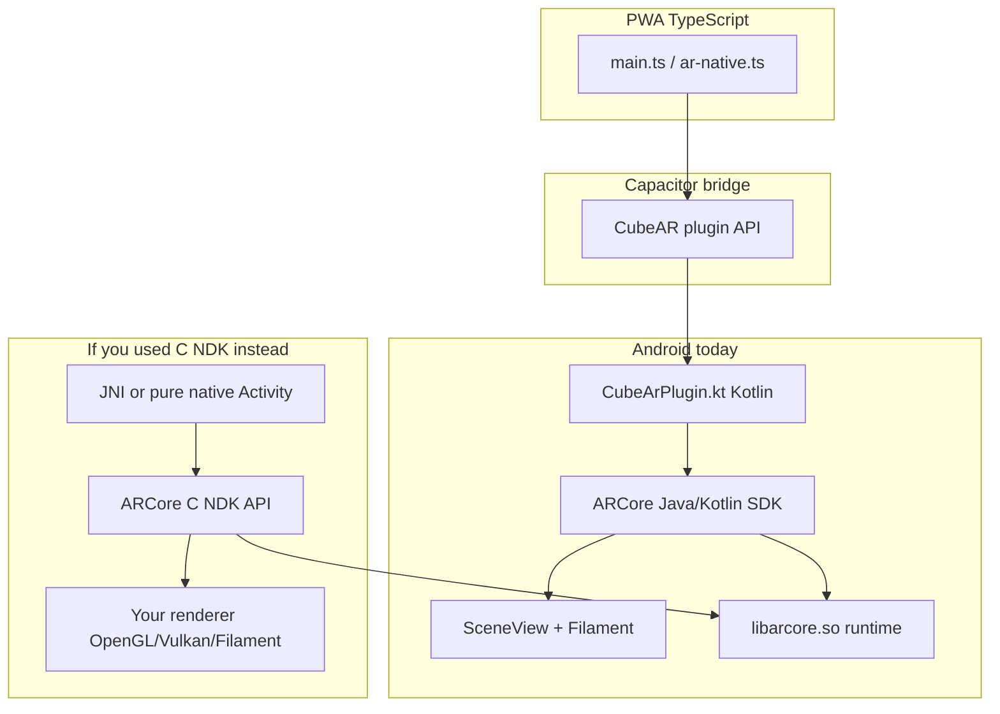

# ARCore C API vs Cross-Platform-AR Today

How the [ARCore Android NDK (C) API](https://developers.google.com/ar/reference/c) relates to this project's Kotlin + SceneView Android path — same ARCore engine, different binding and rendering layers.

## What the C API is

The **ARCore SDK for Android NDK (C)** is Google's **low-level, C-language binding** to the same ARCore runtime this app already uses on Android. It is **Android-only** — there is no Apple ARKit equivalent in this reference.

Core object model (from the reference index):

| C type | Role |
| --- | --- |
| `ArSession` | Session lifecycle: create, configure, resume/pause, destroy |
| `ArConfig` | Plane finding, depth, geospatial, focus/update modes |
| `ArFrame` | Per-frame state after `ArSession_update` |
| `ArCamera` | Tracking state, intrinsics, projection |
| `ArHitResult` / `ArPlane` / `ArAnchor` | Hit-test, surfaces, persistent poses |
| `ArCoreApk` | Install/availability checks (same as Kotlin `ArCoreApk`) |

Advanced APIs exposed in C but **not used** in Cube AR today: `ArEarth` (geospatial/VPS), Cloud Anchor futures, depth mesh, scene semantics, recording/playback, augmented faces/images.

## Same engine, two front doors

Google ships **parallel SDKs** over one native ARCore implementation:

| Layer | What Cross-Platform-AR uses | C NDK alternative |
| --- | --- | --- |
| Availability / install | `ArCoreApk.getInstance().checkAvailability()` / `requestInstall()` | `ArCoreApk_*` |
| Session | Hidden inside SceneView's `arCore` wrapper | `ArSession_create` → `ArSession_configure` → `ArSession_resume` |
| Config | `sceneView.configureSession { config.planeFindingMode = … }` | `ArConfig_setPlaneFindingMode`, etc. |
| Frame loop | `sceneView.onSessionUpdated = { _, frame -> … }` | `ArSession_update(session, &frame)` each frame |
| Hit-test / reticle | `frame.hitTest(x, y)` + plane filter | `ArFrame_hitTest` / instant placement variants |
| Anchor + mesh | `hit.createAnchor()` + SceneView `AnchorNode` + `CubeNode` | `ArSession_acquireNewAnchor` + **you** render the cube |
| Camera feed | SceneView/Filament handles GPU texture | `ArSession_setCameraTextureName(s)` + custom GL pipeline |
| Lifecycle | `handleOnPause` / `handleOnResume` → `arSceneView?.arCore?.pause/resume` | `ArSession_pause` / `ArSession_resume` |

Concept names and semantics align 1:1; only **language, memory ownership, and rendering** differ.

### C API memory model (main practical difference)

C APIs use **explicit create/release** (`ArSession_destroy`, `ArAnchor_release`, …). Kotlin/Java uses GC + try-with-resources patterns. A C or JNI layer must release every acquired object or leak native memory.

### Rendering (biggest architectural gap)

The plugin **does not draw with ARCore directly**. SceneView + Filament owns:

- Camera background texture
- Plane debug meshes
- Reticle and placed `CubeNode` geometry

The C API gives **tracking data and optional CPU/GPU camera images**; you must supply a renderer (OpenGL ES, Vulkan, or embed Filament yourself). SceneView is essentially "ARCore Java SDK + Filament scene graph" — the C reference does **not** include that scene graph.

## Line-by-line mapping to the plugin

Current flow in [`plugins/cube-ar/android/src/main/java/io/worldbuild/cubear/plugin/CubeArPlugin.kt`](../plugins/cube-ar/android/src/main/java/io/worldbuild/cubear/plugin/CubeArPlugin.kt):

1. **Support check** — `ArCoreApk.checkAvailability` → C: `ArCoreApk_checkAvailability`
2. **Install gate** — `requestInstall(activity, true)` → C: `ArCoreApk_requestInstall` (still needs Android `Activity`/`JNIEnv` for UI)
3. **Session config** — horizontal planes, LATEST_CAMERA_IMAGE, AUTO focus → C: equivalent `ArConfig_*` setters before `ArSession_configure`
4. **Reticle** — center-screen `frame.hitTest` filtered to `Plane` in polygon → C: `ArFrame_hitTest` + `ArPlane_isPoseInPolygon`
5. **Tap place** — screen tap hit-test → `createAnchor()` → child cube mesh → C: hit-test → `ArHitResult_acquireAnchor` → custom draw at anchor pose
6. **Tracking events** — `frame.camera.trackingState` → web via Capacitor listeners → C: `ArCamera_getTrackingState`

The **Capacitor bridge** ([`src/ar-native.ts`](../src/ar-native.ts), [`plugins/cube-ar/src/definitions.ts`](../plugins/cube-ar/src/definitions.ts)) would stay unchanged if you swapped the Android backend; only the native implementation behind `CubeAR` would change.

## What Kotlin + SceneView already provides

For a tap-to-place cube showcase, the current stack is the **path of least resistance**:

- **Less boilerplate** — no manual GL texture ring, projection matrices, or anchor release discipline
- **Filament materials** — `MaterialLoader` + `CubeNode` vs writing shaders in C/GL
- **Lifecycle quirks already handled** — comments in the plugin document Capacitor/SceneView edge cases (shared lifecycle, double-init); a raw C/NDK path would re-solve those
- **Same ARCore features for this scope** — plane detection, hit-test, anchors are identical at runtime

Native `.so` libraries (ARCore, Filament) are already pulled transitively by `io.github.sceneview:arsceneview:2.3.0` in [`plugins/cube-ar/android/build.gradle`](../plugins/cube-ar/android/build.gradle). Moving to the C API would **not** remove native deps — it would **replace** SceneView's managed stack with code you own.

## When the C NDK API is worth considering

| Goal | C API fit |
| --- | --- |
| Keep Cube AR as a multi-path showcase | **Poor fit** — Kotlin/SceneView is simpler |
| Share C++ logic with another NDK project (game engine, custom renderer) | **Good fit** |
| Need Geospatial, Depth, Recording, Cloud Anchors at native layer | **Possible in Kotlin too**, but C++ teams often prefer NDK |
| Maximum control over GL/Vulkan render loop | **Good fit** |
| Cross-platform C++ core for Android **and** iOS | **Partial** — C API is Android-only; iOS still needs ARKit (Swift/ObjC) or a separate abstraction |

For ROADMAP items like **persisting anchors** or **geospatial placement**, you can stay on the **Java/Kotlin SDK** — those APIs exist there too. C is not required unless you want a shared C++ module.

## iOS asymmetry (important for "cross-platform")

Cross-Platform-AR's architecture is intentionally **per-platform native**:

- Android: ARCore (Java/Kotlin today)
- iOS: ARKit ([`plugins/cube-ar/ios/Sources/CubeArPlugin/CubeArPlugin.swift`](../plugins/cube-ar/ios/Sources/CubeArPlugin/CubeArPlugin.swift))

The C reference **does not unify** these. A "shared C++ AR core" would still need an ARKit adapter on iOS and an ARCore C adapter on Android — significant engineering for a demo that already works.

## Summary

| Question | Answer |
| --- | --- |
| Is the C API a different AR system? | No — same ARCore runtime, C bindings |
| Does Cube AR use it today? | No — Java/Kotlin SDK via SceneView |
| Should you migrate for the current showcase? | **No** — high effort, no user-visible gain for tap-to-place cubes |
| When to revisit? | Custom C++ renderer, engine integration, or large shared native module |

## References

- [ARCore SDK for Android NDK (C) — API reference](https://developers.google.com/ar/reference/c)
- [ARCore supported devices](https://developers.google.com/ar/devices)
