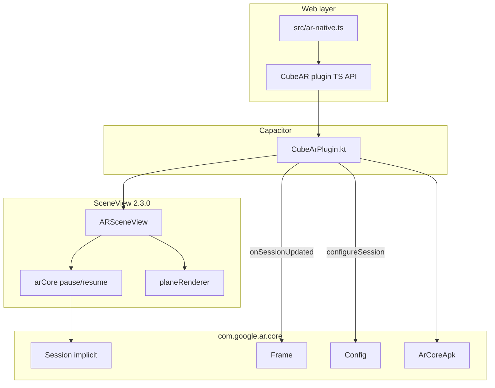
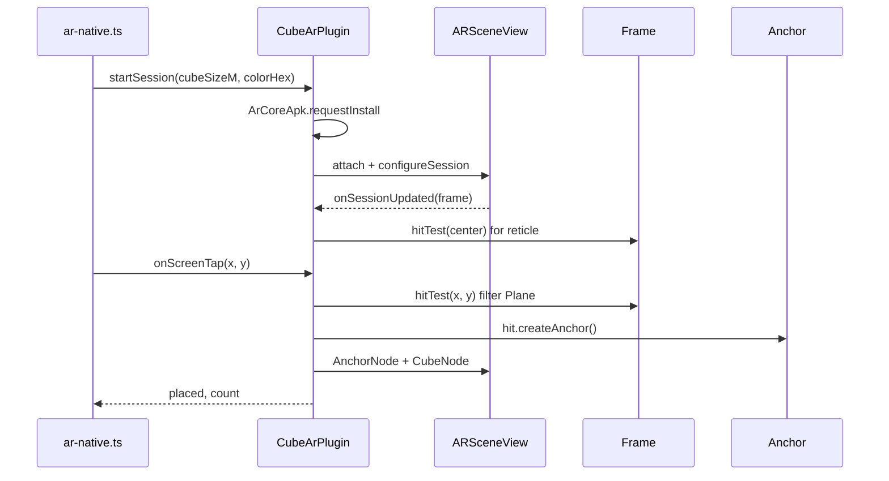

# ARCore Java API ↔ Cube AR mapping

Official reference: [com.google.ar.core package summary](https://developers.google.com/ar/reference/java/com/google/ar/core/package-summary)

This document maps how the Android native path in Cube AR uses the ARCore Java SDK today, what ARSceneView handles implicitly, and which API surface is unused but relevant for future work (see [ROADMAP.md](../../../ROADMAP.md)).

## Architecture

The Android native path does **not** instantiate `Session` directly. It goes through **SceneView** (`io.github.sceneview:arsceneview:2.3.0`), which wraps ARCore session lifecycle, camera feed, and Filament rendering.

**Primary implementation:** [`CubeArPlugin.kt`](src/main/java/io/worldbuild/cubear/plugin/CubeArPlugin.kt)

**Bridge from web:** [`src/ar-native.ts`](../../../src/ar-native.ts) → [`plugins/cube-ar/src/definitions.ts`](../src/definitions.ts)

---

## APIs in active use

| ARCore type | Used where | Purpose in Cube AR |
| --- | --- | --- |
| **`ArCoreApk`** | `isSupported()`, `ensureArCoreAndBeginSession()` | `checkAvailability()` for support probe; `requestInstall()` before session start |
| **`ArCoreApk.InstallStatus`** | install gate | `INSTALL_REQUESTED` → defer start until resume; `INSTALLED` → begin session |
| **`Config`** | `configureSession { _, config -> … }` | Session tuning before first update |
| **`Config.PlaneFindingMode.HORIZONTAL`** | session config | Horizontal plane detection only (matches tap-to-place on floors/tables) |
| **`Config.UpdateMode.LATEST_CAMERA_IMAGE`** | session config | Standard live camera-driven updates |
| **`Config.FocusMode.AUTO`** | session config | Auto camera focus |
| **`Frame`** | `onSessionUpdated`, `placeCubeAtScreen`, `updateReticle` | Per-frame camera state + raycasts |
| **`Frame.hitTest(x, y)`** | reticle + placement | Screen-center reticle and tap raycasts |
| **`Frame.camera.trackingState`** | tracking notifications | Maps to plugin `trackingChanged` events |
| **`HitResult`** | placement + reticle | Intersection with detected geometry |
| **`HitResult.hitPose`** | reticle position | World-space reticle transform |
| **`HitResult.createAnchor()`** | `placeCube()` | Anchors placed cube to real world |
| **`HitResult.trackable`** | hit filtering | Only accept hits on planes |
| **`Plane`** | hit filter | `PlaneHitPick`: TRACKING + horizontal + in-polygon, then table/seat/floor rank + 4 cm inset |
| **`TrackingState`** | tracking callback | `TRACKING` / `PAUSED` / `STOPPED` → initializing / limited / unavailable |
| **`UnavailableUserDeclinedInstallationException`** | install gate | User-facing “ARCore install declined” |
| **`UnavailableDeviceNotCompatibleException`** | install gate | User-facing “not supported on this device” |

### Implicit via ARSceneView (not imported, but required)

| Concern | How it’s handled | Plugin touchpoints |
| --- | --- | --- |
| **`Session` lifecycle** | ARSceneView creates/resumes/pauses session | `arCore.pause()` / `arCore.resume()` in `handleOnPause` / `handleOnResume`; `safeDestroySceneView()` |
| **Camera permission** | Plugin owns permission; SceneView checks disabled | `checkCameraPermission = false` |
| **Availability re-check** | Plugin owns `ArCoreApk`; SceneView check disabled | `checkAvailability = false` |
| **Plane visualization** | Built-in plane renderer | `planeRenderer.isEnabled/isVisible = true` |
| **Rendering** | Filament via SceneView (`CubeNode`, `AnchorNode`, `MaterialLoader`) | Not ARCore API — SceneView/Filament layer |

### Android manifest / Gradle (ARCore integration, not Java API)

- [`android/app/src/main/AndroidManifest.xml`](../../../android/app/src/main/AndroidManifest.xml): `com.google.ar.core` meta-data = `optional`
- [`plugins/cube-ar/android/build.gradle`](build.gradle): `arsceneview:2.3.0` (pulls ARCore SDK transitively; 16 KB page alignment configured)

---

## APIs not used (grouped by relevance)

### High relevance — aligns with ROADMAP “Ideas / later”

| API | What it enables | Fit for this project |
| --- | --- | --- |
| **`Anchor`** (direct) | Local anchor UUID, detach, persistence hooks | Needed before cross-session persistence |
| **`Session.hostCloudAnchorAsync` / `ResolveCloudAnchorFuture`** | Multi-user / cross-device shared anchors | ROADMAP: “Persist placed cubes across sessions” |
| **`Config.InstantPlacementMode` + `InstantPlacementPoint`** | Place before plane fully tracked | Faster first placement UX (WebXR already uses hit-test reticle pattern) |
| **`Config.DepthMode` + `DepthPoint`** | Occlusion, depth-based hits | Richer placement (cubes behind/on objects) |
| **`LightEstimate` + `Config.LightEstimationMode`** | Scene lighting match | Better Filament material realism |
| **`Config.PlaneFindingMode.VERTICAL`** (or both) | Wall detection | Expand beyond horizontal-only demo |

### Medium relevance — showcase / platform parity

| API | Notes |
| --- | --- |
| **`AugmentedImage` / `AugmentedImageDatabase`** | Image-target AR path (distinct from plane tap-to-place) |
| **`AugmentedFace`** | Face filters / face-anchored content |
| **`PointCloud` / `Point`** | Debug viz or feature-point placement |
| **`Mesh` / `StreetscapeGeometry` + `Config.StreetscapeGeometryMode`** | Geospatial mesh alignment |
| **`Earth` / `GeospatialPose` + `Config.GeospatialMode`** | VPS / lat-lng placement outdoors |
| **`VpsAvailabilityFuture`** | Pre-check VPS before geospatial session |
| **`Camera` / `CameraIntrinsics` / `CameraConfig`** | Advanced camera selection or computer-vision pipelines |
| **`Pose`** (direct) | Manual transforms if bypassing SceneView nodes |
| **`Trackable` interface** | Generalized filtering beyond `Plane` |

### Low relevance for current v0.2 scope

| API | Why skipped today |
| --- | --- |
| **`RecordingConfig` / `Track` / `TrackData` / `RecordingStatus`** | Session recording — not part of demo |
| **`SharedCamera` / `ImageMetadata` / `ImageFormat`** | Shared camera / raw image pipelines |
| **`PlaybackStatus`** | Playback of recorded sessions |
| **`SemanticLabel` + `Config.SemanticMode`** | Per-pixel scene labels |
| **`ResolveAnchorOnTerrainFuture` / `RooftopAnchorFuture`** | Niche geospatial anchor types |
| **`Future` / `FutureState`** | Only needed when adopting async Cloud/Geospatial APIs |
| **`Coordinates2d` / `Coordinates3d`** | Coordinate-space conversions for advanced hit tests |
| **`Session.Feature` / `FeatureMapQuality`** | Explicit feature requests when constructing `Session` manually |
| **`TrackingFailureReason`** | Could enrich debug overlay (currently only `TrackingState`) |

---

## Parity: Android ARCore vs iOS ARKit plugin

Both plugins expose the same Capacitor surface (`isSupported`, `startSession`, `stopSession`, `onScreenTap`, events). Platform mapping:

| Concept | Android (ARCore) | iOS (ARKit) |
| --- | --- | --- |
| Support check | `ArCoreApk.checkAvailability()` | `ARWorldTrackingConfiguration.isSupported` |
| Install gate | `ArCoreApk.requestInstall()` | N/A |
| Session | ARSceneView + implicit `Session` | `ARSCNView` + `ARSession` |
| Plane detection | `Config.planeFindingMode` + `Plane` hits | `planeDetection = .horizontal` |
| Hit test | `Frame.hitTest` | `raycastQuery` / `existingPlaneUsing` |
| Anchor | `HitResult.createAnchor()` | `ARAnchor` on raycast result |
| Tracking states | `TrackingState` on camera | `ARCamera.trackingState` |

**iOS counterpart:** [`plugins/cube-ar/ios/Sources/CubeArPlugin/CubeArPlugin.swift`](../ios/Sources/CubeArPlugin/CubeArPlugin.swift)

---

## Data flow (tap-to-place)

---

## Summary

**Today the plugin uses ~12% of the public `com.google.ar.core` surface** — focused on availability/install, basic session config, plane hit-testing, anchors, and tracking state. The majority of the package (Cloud Anchors, Geospatial, Depth, Instant Placement, semantics, recording, augmented images/faces) is unused but documented above for future expansion.
